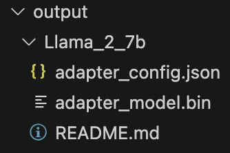
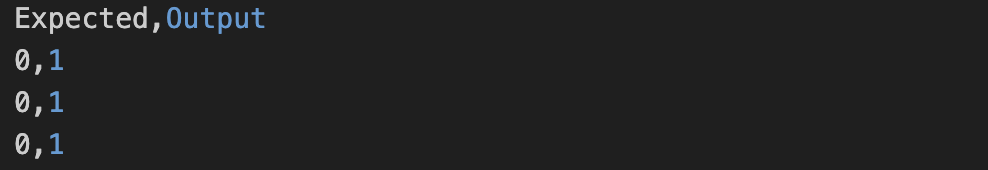

# Welcome to ESG Fine-tuning Repository
***Birti Mattia***  - ***Osborne Francesco*** - ***Maurino Andrea***
This repository is dedicated to the fine-tuning of various Language Models (LLMs), including Llama, Llama2, Llama3, Gemma2B, Gemma7B, RecurrentGemma2B and Mistral, with a specific focus on enhancing their efficiency for exploring ESG (Environment, Social, and Governance) related topics.

## Basic Info:

### LLMs models:
- LLama_3B -> [https://huggingface.co/openlm-research/open_llama_3b]
- Llama2_7B -> [https://huggingface.co/meta-llama/Llama-2-7b-chat-hf]
- Llama3_8B -> [https://huggingface.co/meta-llama/Meta-Llama-3-8B]
- Gemma_2B -> [https://huggingface.co/google/gemma-2b]
- Gemma_7B -> [https://huggingface.co/google/gemma-7b]
- RecurrentGemma_2B -> [https://huggingface.co/google/recurrentgemma-2b]
- Mistral -> [https://huggingface.co/mistralai/Mistral-7B-v0.1]


**Warning:** To use some models like *Llama2_7B*, you need to add the huggingface authentication token. 

### Pip and Requirement:
**Linux:**
```bash
sudo apt update
curl https://bootstrap.pypa.io/get-pip.py -o get-pip.py
sudo python3 get-pip.py
```

```bash
pip install -r requirements.txt
```

### Dataset:
[Train Dataset example here](data/example_classify.json)


## Run 

#### Finetuning
```bash
python3 finetune.py --model_type llama_3B --data "./data/train/data.json" --adapter "lora" --output_dir "output/nameFolder" --EvalFolder "nameFolder" --epochs 20
```
* **gemma_7B** and **llama2_7B** are the only notebooks that implements both crossvalidation and normal training. You can select the mode via the keyword *--modality*
    * *--modality "normal"*
    * *--modality "cross"*
    * *--modality "crossANDnormal"*


#### Inference
```bash
python3 inference.py --model_type llama_3B --data "./data/train/data.json" --adapter_weights "output/nameFolder" --labels '["0", "1"]' --InferenceFolder "nameInferenceFolder"
```


## Repository:

### finetune.py
Script used to launch finetuning of the selected model. Contains all passed and default parameters.  
*Output -> output/name_model/*  



### inference.py
Script used to launch inference of the selected model. Contains all passed and default parameters.  
*Output -> eval/.csv*  


### core/llm.py
Mother class of LLMs.
Contains all common functions and standard parameters.

### core/models/
- **llama_3B.py**
- **llama2_7B.py**
- **llama3_8B.py**
- **gemma_2B.py**
- **gemma_7B.py** 
- **recurrentGemma_2B.py**
- **mistral.py**  

These scripts contain the actual **training** and **inference** for each model.

### data/get_train.ipynb
Notebook used to obtain the final dataset for finetuning.
We start from a **.csv** to obtain the final **.json**.

### eval/evaluation.ipynb
Notebook used to calculate and compare the evaluation metrics of the different models.

### results
Folder containing all the .csv obtained for the different experiments.
